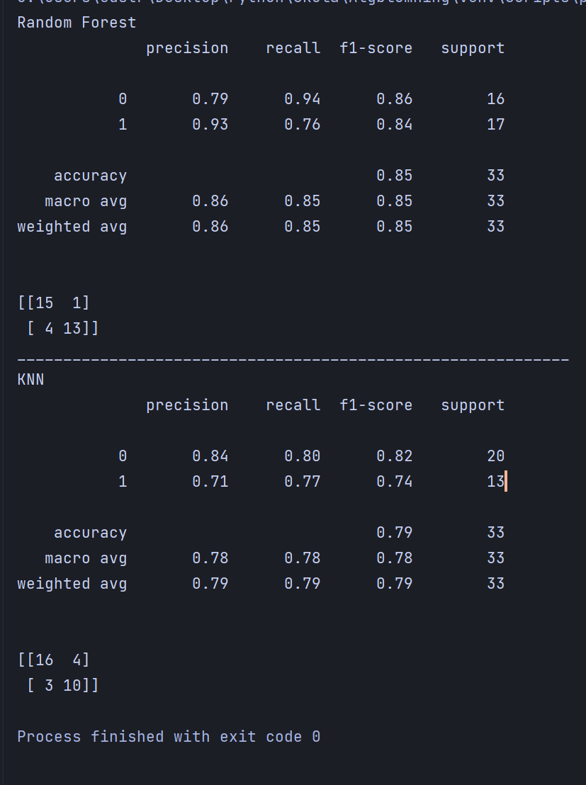
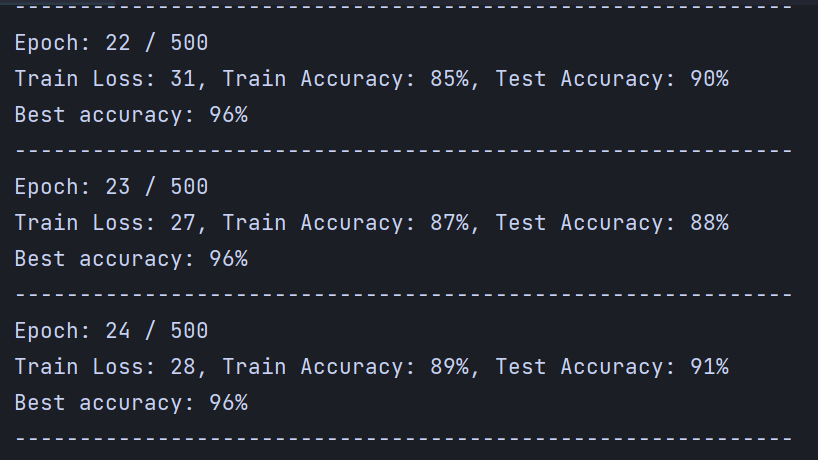
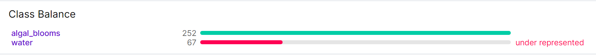

# Algae blooms

## Table of contents

[Project description](#desc)  
[How it works](#howitworks)  
[Dataset review](#Dataset)
[Our Challenges](#challenges)  
[Future development](#Future_development)  
[Installation and how to run](#install)  
[Contribution](#credits)  

## Project description
Algae blooms are a massive amount of 
microscopic algae and cyanobacteria, 
most commonly appearing during spring 
and summer due to higher temperatures in the water, 
leading to more access to nutrients.  
Some bacteria produces toxins which harms both the environment 
and humans coming to contact with the toxins.

This is a rising issue, and more and more actors in Sweden are investing 
time and resources into warning about possible Algae blooming.

We've received an assigment to build an automated system, that can detect algae blooming through images of water surfaces, preferably using Deep learning.

## How it works
 This application uses a CNN-model to predict whether the image uploaded contains traces of Algae blooms, and returns a prediction containing confidence-level as well as a label for the image.
We also save the images in our database, for further training, to make sure the model stays updated, and learns as we receive more data.

We decided to use a CNN model after testing different Machine Learning models, as well as a few deep learning models.   
   
Machine Learning algorithms reviewed:
 - KNN
 - Random Forest  
   

      When evaluating our ML-models, we realized that the accuracy was very inconsistent. 
      and the more complex data we gave the models, the more randomized our results got.
 

Deep Learning models reviewed:
 - CNN
 - RCNN
 
        We got way better, and more consistent results on our Deep Learning models, 
        especially the CNN model. We ended up with a accuracy on around 96%,
        and felt a lot more confident on the performance of our CNN, 
        and decided to go for a CNN.
    

We also decided to use FastAPI because it's one of the most lightweight
API / web-frameworks to use, and it keeps getting constant updates for performance.

## Dataset review

This is the class balance of the dataset we received, as you can see, we had a huge over representation of the Algae class, 
resulting in the model defaulting for a positive prediction. We managed to get an accuracy on about 96% on the dataset, 
but we quickly realized that the model was over fit on our current data.

To solve this, we decided to take our own pictures of water surfaces to add to our dataset, 
and make sure we get a better class balance. After the new data was added we managed to get around 45% / 55% class balance

This resulted in a better performance on the test data, and our model managed to correctly predict on more images, 
at the cost of about 5% accuracy, which is as trade-off we're happy with.

restrictions:  
Since our dataset was limited to water surfaces only, we are forced to keep this in mind when doing our inference. 
Right now we have to assume that the user are uploading images containing a water surface, until we manage to expand our
dataset to handle all cases. Especially images containing grass, since this is the biggest
issue for the model. 

## Our challenges
Our biggest challenge have been a lack of good spread of our data, we've had a big over-representation 
of our positive images, containing algae, and we had an issue causing the model to default to 
a positive result, even though the image was clearly not containing any traces of algae.  
The solution we ended up going for was to collect more data of negative images, so we went out and took photos of "Värnen"(Lidköping-Sweden) to add to our dataset, in order to restore some balance to our data.

After adding the data, we had a much lower accuracy of the model on the validation-step, but ultimately, we ended up with a better performance on the inference.

We're not front-end developers, so we have decided on a minimal design of the page, and put more of our efforts on the functionality of the model. 

## Future development
<!-- ADD MORE HERE LATER ...-->
Our plan for the future of this project is to deploy the service as it is, and start gathering data from the users, in order to solve our data-problem.
Gathering data from the users, solves multiple problems.

We get to add some balance to our data, and gives better training-sessions for the model.

We get to identify any problems the model might have, that we haven't been able to 
identify with the data we have right now.

and finally, we can start doing continuous training, 
where we train our model on the data we receive, in order to adapt the prediction and make it more resilient to any form of disturbance in the images.

We also want to build an end-point in our framework 
where we can broadcast any recurring areas, where we have a possible algae outbreak.

## Installation and how to run
<!-- Add a REQUIREMENTS.TXT-->
    How to install:
        1.  fork the project, and install the requirements.txt in your local enviroemnt.
            make sure you get the data-folders containing our data, if you want to train the model on your own.
            if not, we provide a pre-trained model, with CUDA.
        
        2.  to train on your own data, or train on the data we provide, add the data-folder to the following path:
            "nn_model/Your_data_here" (We use the default-name "data_jpg", 
            if you want to change name of the folder, you have to change the name and paths in settings.txt
        
        3.  Open a terminal in your root, and enter the following command:
            uvicorn application.api:app --reload
            This is going to start a local instance of FlasKAPI, and it will automatically load our model to our front-end.
        
        (4.)    We are using a settings.txt to keep our project easy to maintain, if you want to change any locations of your folders,
                or if you want to change hyper-parameters for your own training-session. you have to change the settings in there.

## Contribution
[Fredrik](https://github.com/Fredstrom)  
[Anna](https://github.com/QueenAnna)  
[Alexander Nyberg](https://github.com/aanyberg)  
[Lenny](https://github.com/lennyrydweissner)  
[Alexander Amaechi](https://github.com/AlexanderAmaechi)  

